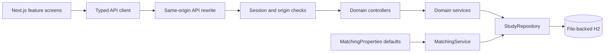
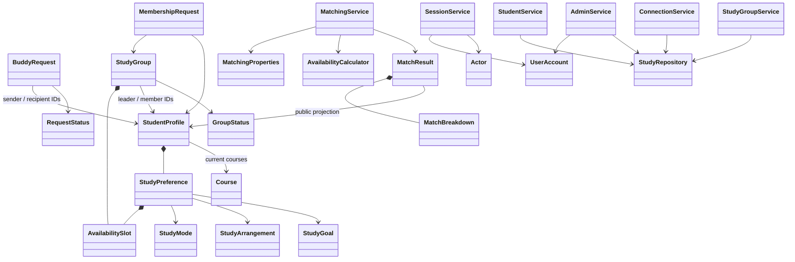

# Architecture and design decisions

The supplied template's `student`, `matching`, `connection`, `group`, and `admin` packages remain the domain boundaries. Controllers translate HTTP input; services enforce business rules; models describe domain data; the persistence package owns SQL and serialization. Frontend feature folders mirror these capabilities.

## Key responsibilities

- `Actor` represents trusted session identity. It is not accepted from JSON. Group leadership is checked dynamically against each group, so a transfer changes permissions immediately.
- `SessionService` resolves active accounts on every API request; suspension/deletion therefore invalidates existing session access without waiting for cookie expiry. The demo login rotates the session ID. It is intentionally not a password-based identity provider.
- `StudentService.publicProfile` is the only viewer-aware contact projection. General directories and ranked matches always hide the number. Administrators do not automatically receive contact details.
- `ConnectionService` treats an accepted buddy request as the active connection record. A separate redundant `Connection` entity is unnecessary for the specified lifecycle. Declined/ended requests remain history; new requests may then be sent.
- `AvailabilityCalculator` converts weekly slots to a 10,080-bit minute set. Union removes duplicate coverage; intersection counts shared minutes. This is deterministic and avoids nested-loop double counting.
- `MatchingService` normalizes configurable weights, applies one of three strategy policies, evaluates five criteria, and constructs a public result with a score breakdown. The pure scoring helpers are separated from configuration persistence and candidate filtering.
- `StudyGroupService` owns membership capacity, decisions, closure, and transfer/exit transitions. Group update preserves membership/status/leader fields even if a client supplies forged values.
- `AdminService` handles account lifecycle across profiles, requests, and groups inside one transaction. Active leadership prevents deletion/suspension until transferred or closed.
- `StudyRepository` isolates JSON aggregate persistence. Its lock is acquired before all business writes. H2 transactions roll back the whole action on a business error. A concurrent capacity test verifies the shared lock protects the last available seat.
- `DemoDataInitializer` checks a persisted marker inside the same lock/transaction. It does not reseed based on current student count, which would incorrectly recreate deleted accounts.
- `ApiExceptionHandler` provides consistent errors without exposing SQL, stack traces, or internal exception details to the browser.
- Frontend feature components own local form state; the workspace shell loads current data, switches accounts, and clears prior-account screens. The typed client sends cookie-backed requests through Next.js and parses API errors.

## Deliberate limits

H2 JSON aggregates retain the starter's simple POJOs. They provide real restart persistence but no SQL-level foreign keys on JSON fields. Services enforce relationships. All writes serialize on a database row; this is appropriate for the 50-profile demonstration, with lower throughput than per-aggregate locking. There is no distributed cache, queue, or background notification service.

The frontend uses one App Router page with domain components and tab navigation, preserving the template's single dashboard model. Tabs are not bookmarkable routes. State refresh is explicit after mutations or through Refresh data; there is no live cross-browser push. The current session identity is shared between tabs of the same browser cookie context.

The dependencies were retained to respect the template. Before any public deployment, replace the demo identity flow, plan database migrations, review current dependency security support, configure HTTPS, and perform a production security review. None of those deployment changes are claimed here.
